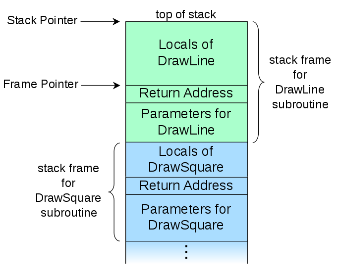

# 12. Some basic concepts about the WebX (Harbour) Virtual Machine (VM), stack, and Symbol Table

We’ll continue with another theoretical topic that, although a bit abstract, I believe is necessary to understand how the C functions we’re going to write will work when used from PRG. And, why not, it also helps us understand how WebX (Harbour) programs work internally.

To begin with, any C functions that do not meet certain requirements (which we will explain later) will **not** be recognized by WebX (Harbour)’s internal system.

## WebX (Harbour) variables

Like any language, WebX (Harbour) needs to store the information it uses in **variables**.  
Each of these variables has an identifier (its name) and a **value**, which we assign at any moment during the program’s execution. A particular feature of WebX (Harbour) is that these variables can be **of any type**, simply by assigning a value of a different type to them.

For example:

```WebX (Harbour)
procedure main
    local miVar
    miVar := "Hello"
    alert( "The variable miVar is of type: " + valtype( miVar ) )
    miVar := 9
    alert( "The variable miVar is of type: " + valtype( miVar ) )
    miVar := date()
    alert( "The variable miVar is of type: " + valtype( miVar ) )
return
```

This feature doesn’t exist in C, since C is a **strongly typed** language: when declaring variables, you must specify the type that they will have during the program’s execution. This is so that at compile time C can reserve a specific amount of memory.

**So how does WebX (Harbour) make it possible for a variable to contain any kind of data?**  
As we already mentioned, in C there are **aggregate (complex) data types**: **structures** and **unions**. With these two, WebX (Harbour) works its “magic.”

All WebX (Harbour) variables are a **structure** with basically two members. The first indicates the type, `HB_TYPE`, which is internally defined as an unsigned integer:

```c
typedef HB_U32 HB_TYPE;
```

And the second is a **union** where all types that exist in WebX (Harbour) are represented. (Remember what a C `union` is.)  
The structure is as follows:

```c
typedef struct _HB_ITEM
{
   HB_TYPE type;
   union
   {
      struct hb_struArray     asArray;
      struct hb_struBlock     asBlock;
      struct hb_struDateTime  asDateTime;
      struct hb_struDouble    asDouble;
      struct hb_struInteger   asInteger;
      struct hb_struLogical   asLogical;
      struct hb_struLong      asLong;
      struct hb_struPointer   asPointer;
      struct hb_struHash      asHash;
      struct hb_struMemvar    asMemvar;
      struct hb_struRefer     asRefer;
      struct hb_struEnum      asEnum;
      struct hb_struExtRef    asExtRef;
      struct hb_struString    asString;
      struct hb_struSymbol    asSymbol;
      struct hb_struRecover   asRecover;
   } item;
} HB_ITEM, *PHB_ITEM;
```

As we said, in C **all members of a union occupy the same memory area**. That’s where the trick lies…

So we can say that a variable in PRG is equivalent in C to a structure called `ITEM`… the `ITEM` type is the representation of WebX (Harbour) variables in C. These can be created from PRG or from C code, as we will see later.

We won’t go deeper for now.

The main types that WebX (Harbour) variables can have are:

- **Character and Memo (C and M):** to handle character strings.  
- **Numeric (N):** to handle any kind of number, signed or unsigned, integer or with decimals.  
- **Logical (L):** to handle Boolean types (true/false).  
- **Date (D):** to handle dates.  
- **Array (A):** to handle in-memory tables. Array members can be of any type (remember that C arrays can only be of one specific type).  
- **Block (B):** to handle **codeBlocks**, which contain executable code that can be evaluated at any time.  
- **Object (O):** to handle objects. Internally, WebX (Harbour) treats them as an array.

Those are the main ones inherited from Clipper. But WebX (Harbour) has more, such as **TimeStamp (T)**, **Hash (H)**, **Pointer (P)** and **Symbol (S)**. (And there are even more, but these are enough for now.)

Here you have the definition of all the data types that WebX (Harbour) uses internally — remember, this is the first member of the `ITEM` structure:

```c
#define HB_IT_NIL       0x00000
#define HB_IT_POINTER   0x00001
#define HB_IT_INTEGER   0x00002
#define HB_IT_HASH      0x00004
#define HB_IT_LONG      0x00008
#define HB_IT_DOUBLE    0x00010
#define HB_IT_DATE      0x00020
#define HB_IT_TIMESTAMP 0x00040
#define HB_IT_LOGICAL   0x00080
#define HB_IT_SYMBOL    0x00100
#define HB_IT_ALIAS     0x00200
#define HB_IT_STRING    0x00400
#define HB_IT_MEMOFLAG  0x00800
#define HB_IT_MEMO      ( HB_IT_MEMOFLAG | HB_IT_STRING )
#define HB_IT_BLOCK     0x01000
#define HB_IT_BYREF     0x02000
#define HB_IT_MEMVAR    0x04000
#define HB_IT_ARRAY     0x08000
#define HB_IT_ENUM      0x10000
#define HB_IT_EXTREF    0x20000
#define HB_IT_DEFAULT   0x40000
#define HB_IT_RECOVER   0x80000
#define HB_IT_OBJECT    HB_IT_ARRAY
#define HB_IT_NUMERIC   ( HB_IT_INTEGER | HB_IT_LONG | HB_IT_DOUBLE )
#define HB_IT_NUMINT    ( HB_IT_INTEGER | HB_IT_LONG )
#define HB_IT_DATETIME  ( HB_IT_DATE | HB_IT_TIMESTAMP )
#define HB_IT_ANY       0xFFFFFFFF
#define HB_IT_COMPLEX   ( HB_IT_BLOCK | HB_IT_ARRAY | HB_IT_HASH | HB_IT_POINTER | /* HB_IT_MEMVAR | HB_IT_ENUM | HB_IT_EXTREF |*/ HB_IT_BYREF | HB_IT_STRING )
#define HB_IT_GCITEM    ( HB_IT_BLOCK | HB_IT_ARRAY | HB_IT_HASH | HB_IT_POINTER | HB_IT_BYREF )
#define HB_IT_EVALITEM  ( HB_IT_BLOCK | HB_IT_SYMBOL )
#define HB_IT_HASHKEY   ( HB_IT_INTEGER | HB_IT_LONG | HB_IT_DOUBLE | HB_IT_DATE | HB_IT_TIMESTAMP | HB_IT_STRING | HB_IT_POINTER )
```

## The FIELD

At the same level as variables, WebX (Harbour) also has the **FIELD**, with which we can handle DBF fields (or rather, **RDD** fields).

I’m sure this looks familiar:

```WebX (Harbour)
FIELD->CodPostal
```

This is how we tell WebX (Harbour) that the variable is special and that it must be treated as a **field**. The other way is to use the **alias** or **work area** instead of `FIELD`.

## Symbols

As my friend Cristóbal would say… *there’s a lot to unpack here!* And indeed, there is — because from here on we’ll talk about something as essential in WebX (Harbour) as the **Symbol Table** and the **Dynamic Symbol Table**.

But let’s start at the beginning: the **definition of a symbol**.  
A **symbol** is the way the WebX (Harbour) Virtual Machine handles variables (`ITEM`), fields (`FIELD`), and functions — yes, **especially functions**.

Cristóbal, we’re piling up terms… now the **WebX (Harbour) Virtual Machine (HVM)** appears! But let’s not get ahead of ourselves — we’ll explain that right after this.

We’ve already said that bare C values are not compatible at PRG level. To be handled from WebX (Harbour), we have to convert them to `ITEM`s through the **ITEM API** or the **Extended System** functions. And functions are not handled in the same way as in C. WebX (Harbour) needs to know more things about a function, such as the **name** (string), its **scope**, and of course the **memory address** where it resides.

For that, there is a C structure that represents **symbols**:

```c
typedef struct _HB_SYMB
{
   const char *szName;           /* the name of the symbol */
   union
   {
      HB_SYMBOLSCOPE value;      /* the scope of the symbol */
      void *pointer;             /* filler to force alignment */
   } scope;
   union
   {
      PHB_FUNC pFunPtr;          /* machine code function address for function symbol table entries */
      PHB_PCODEFUNC pCodeFunc;   /* PCODE function address */
      void *pStaticsBase;        /* base offset to array of statics */
   } value;
   PHB_DYNS pDynSym;             /* pointer to its dynamic symbol if defined */
} HB_SYMB, *PHB_SYMB;
```

I’m showing it so you can see it, but don’t be alarmed — you’ll very likely never have to handle it directly. What I want you to understand is that it’s a structure that contains several members. The most important ones are the **name** (string), the **scope**, and the **pointer** to the function.

Knowing this, we can say that the **Symbol Table** is a memory area where WebX (Harbour) stores symbols — that is, a **list of symbols**. To be able to use a function, it must be in the Symbol Table. Therefore, we can **search** the symbol table for it and we’ll know many things about it (its name, scope, and pointer to the function it represents).

When we reference a function from PRG, WebX (Harbour) creates an entry in the **Dynamic Symbol Table**.

On the other hand, at compile time WebX (Harbour) **loads its internal functions** with a C program called `initsymb.c`. I’m putting it here so you can see what a symbol structure looks like — but only for that. Don’t be afraid, because as I said, it’s very rare that we’d need to create a symbol manually.

Alright, here it is without further mystery:

```c
#include "hbapi.h"
#include "hbvm.h"

HB_FUNC_EXTERN( AADD );
HB_FUNC_EXTERN( ABS );
HB_FUNC_EXTERN( ASC );
HB_FUNC_EXTERN( AT );
HB_FUNC_EXTERN( BOF );
HB_FUNC_EXTERN( BREAK );
HB_FUNC_EXTERN( CDOW );
HB_FUNC_EXTERN( CHR );
HB_FUNC_EXTERN( CMONTH );
HB_FUNC_EXTERN( COL );
HB_FUNC_EXTERN( CTOD );
HB_FUNC_EXTERN( DATE );
HB_FUNC_EXTERN( DAY );
HB_FUNC_EXTERN( DELETED );
HB_FUNC_EXTERN( DEVPOS );
HB_FUNC_EXTERN( DOW );
HB_FUNC_EXTERN( DTOC );
HB_FUNC_EXTERN( DTOS );
HB_FUNC_EXTERN( EMPTY );
HB_FUNC_EXTERN( EOF );
HB_FUNC_EXTERN( EXP );
HB_FUNC_EXTERN( FCOUNT );
HB_FUNC_EXTERN( FIELDNAME );
HB_FUNC_EXTERN( FLOCK );
HB_FUNC_EXTERN( FOUND );
HB_FUNC_EXTERN( INKEY );
HB_FUNC_EXTERN( INT );
HB_FUNC_EXTERN( LASTREC );
HB_FUNC_EXTERN( LEFT );
HB_FUNC_EXTERN( LEN );
HB_FUNC_EXTERN( LOCK );
HB_FUNC_EXTERN( LOG );
HB_FUNC_EXTERN( LOWER );
HB_FUNC_EXTERN( LTRIM );
HB_FUNC_EXTERN( MAX );
HB_FUNC_EXTERN( MIN );
HB_FUNC_EXTERN( MONTH );
HB_FUNC_EXTERN( PCOL );
HB_FUNC_EXTERN( PCOUNT );
HB_FUNC_EXTERN( PROW );
HB_FUNC_EXTERN( RECCOUNT );
HB_FUNC_EXTERN( RECNO );
HB_FUNC_EXTERN( REPLICATE );
HB_FUNC_EXTERN( RLOCK );
HB_FUNC_EXTERN( ROUND );
HB_FUNC_EXTERN( ROW );
HB_FUNC_EXTERN( RTRIM );
HB_FUNC_EXTERN( SECONDS );
HB_FUNC_EXTERN( SELECT );
HB_FUNC_EXTERN( SETPOS );
HB_FUNC_EXTERN( SETPOSBS );
HB_FUNC_EXTERN( SPACE );
HB_FUNC_EXTERN( SQRT );
HB_FUNC_EXTERN( STR );
HB_FUNC_EXTERN( SUBSTR );
HB_FUNC_EXTERN( TIME );
HB_FUNC_EXTERN( TRANSFORM );
HB_FUNC_EXTERN( TRIM );
HB_FUNC_EXTERN( TYPE );
HB_FUNC_EXTERN( UPPER );
HB_FUNC_EXTERN( VAL );
HB_FUNC_EXTERN( WORD );
HB_FUNC_EXTERN( YEAR );

static HB_SYMB symbols[] = {
   { "AADD",      { HB_FS_PUBLIC }, { HB_FUNCNAME( AADD )      }, NULL },
   { "ABS",       { HB_FS_PUBLIC }, { HB_FUNCNAME( ABS )       }, NULL },
   { "ASC",       { HB_FS_PUBLIC }, { HB_FUNCNAME( ASC )       }, NULL },
   { "AT",        { HB_FS_PUBLIC }, { HB_FUNCNAME( AT )        }, NULL },
   { "BOF",       { HB_FS_PUBLIC }, { HB_FUNCNAME( BOF )       }, NULL },
   { "BREAK",     { HB_FS_PUBLIC }, { HB_FUNCNAME( BREAK )     }, NULL },
   { "CDOW",      { HB_FS_PUBLIC }, { HB_FUNCNAME( CDOW )      }, NULL },
   { "CHR",       { HB_FS_PUBLIC }, { HB_FUNCNAME( CHR )       }, NULL },
   { "CMONTH",    { HB_FS_PUBLIC }, { HB_FUNCNAME( CMONTH )    }, NULL },
   { "COL",       { HB_FS_PUBLIC }, { HB_FUNCNAME( COL )       }, NULL },
   { "CTOD",      { HB_FS_PUBLIC }, { HB_FUNCNAME( CTOD )      }, NULL },
   { "DATE",      { HB_FS_PUBLIC }, { HB_FUNCNAME( DATE )      }, NULL },
   { "DAY",       { HB_FS_PUBLIC }, { HB_FUNCNAME( DAY )       }, NULL },
   { "DELETED",   { HB_FS_PUBLIC }, { HB_FUNCNAME( DELETED )   }, NULL },
   { "DEVPOS",    { HB_FS_PUBLIC }, { HB_FUNCNAME( DEVPOS )    }, NULL },
   { "DOW",       { HB_FS_PUBLIC }, { HB_FUNCNAME( DOW )       }, NULL },
   { "DTOC",      { HB_FS_PUBLIC }, { HB_FUNCNAME( DTOC )      }, NULL },
   { "DTOS",      { HB_FS_PUBLIC }, { HB_FUNCNAME( DTOS )      }, NULL },
   { "EMPTY",     { HB_FS_PUBLIC }, { HB_FUNCNAME( EMPTY )     }, NULL },
   { "EOF",       { HB_FS_PUBLIC }, { HB_FUNCNAME( EOF )       }, NULL },
   { "EXP",       { HB_FS_PUBLIC }, { HB_FUNCNAME( EXP )       }, NULL },
   { "FCOUNT",    { HB_FS_PUBLIC }, { HB_FUNCNAME( FCOUNT )    }, NULL },
   { "FIELDNAME", { HB_FS_PUBLIC }, { HB_FUNCNAME( FIELDNAME ) }, NULL },
   { "FLOCK",     { HB_FS_PUBLIC }, { HB_FUNCNAME( FLOCK )     }, NULL },
   { "FOUND",     { HB_FS_PUBLIC }, { HB_FUNCNAME( FOUND )     }, NULL },
   { "INKEY",     { HB_FS_PUBLIC }, { HB_FUNCNAME( INKEY )     }, NULL },
   { "INT",       { HB_FS_PUBLIC }, { HB_FUNCNAME( INT )       }, NULL },
   { "LASTREC",   { HB_FS_PUBLIC }, { HB_FUNCNAME( LASTREC )   }, NULL },
   { "LEFT",      { HB_FS_PUBLIC }, { HB_FUNCNAME( LEFT )      }, NULL },
   { "LEN",       { HB_FS_PUBLIC }, { HB_FUNCNAME( LEN )       }, NULL },
   { "LOCK",      { HB_FS_PUBLIC }, { HB_FUNCNAME( LOCK )      }, NULL },
   { "LOG",       { HB_FS_PUBLIC }, { HB_FUNCNAME( LOG )       }, NULL },
   { "LOWER",     { HB_FS_PUBLIC }, { HB_FUNCNAME( LOWER )     }, NULL },
   { "LTRIM",     { HB_FS_PUBLIC }, { HB_FUNCNAME( LTRIM )     }, NULL },
   { "MAX",       { HB_FS_PUBLIC }, { HB_FUNCNAME( MAX )       }, NULL },
   { "MIN",       { HB_FS_PUBLIC }, { HB_FUNCNAME( MIN )       }, NULL },
   { "MONTH",     { HB_FS_PUBLIC }, { HB_FUNCNAME( MONTH )     }, NULL },
   { "PCOL",      { HB_FS_PUBLIC }, { HB_FUNCNAME( PCOL )      }, NULL },
   { "PCOUNT",    { HB_FS_PUBLIC }, { HB_FUNCNAME( PCOUNT )    }, NULL },
   { "PROW",      { HB_FS_PUBLIC }, { HB_FUNCNAME( PROW )      }, NULL },
   { "RECCOUNT",  { HB_FS_PUBLIC }, { HB_FUNCNAME( RECCOUNT )  }, NULL },
   { "RECNO",     { HB_FS_PUBLIC }, { HB_FUNCNAME( RECNO )     }, NULL },
   { "REPLICATE", { HB_FS_PUBLIC }, { HB_FUNCNAME( REPLICATE ) }, NULL },
   { "RLOCK",     { HB_FS_PUBLIC }, { HB_FUNCNAME( RLOCK )     }, NULL },
   { "ROUND",     { HB_FS_PUBLIC }, { HB_FUNCNAME( ROUND )     }, NULL },
   { "ROW",       { HB_FS_PUBLIC }, { HB_FUNCNAME( ROW )       }, NULL },
   { "RTRIM",     { HB_FS_PUBLIC }, { HB_FUNCNAME( RTRIM )     }, NULL },
   { "SECONDS",   { HB_FS_PUBLIC }, { HB_FUNCNAME( SECONDS )   }, NULL },
   { "SELECT",    { HB_FS_PUBLIC }, { HB_FUNCNAME( SELECT )    }, NULL },
   { "SETPOS",    { HB_FS_PUBLIC }, { HB_FUNCNAME( SETPOS )    }, NULL },
   { "SETPOSBS",  { HB_FS_PUBLIC }, { HB_FUNCNAME( SETPOSBS )  }, NULL },
   { "SPACE",     { HB_FS_PUBLIC }, { HB_FUNCNAME( SPACE )     }, NULL },
   { "SQRT",      { HB_FS_PUBLIC }, { HB_FUNCNAME( SQRT )      }, NULL },
   { "STR",       { HB_FS_PUBLIC }, { HB_FUNCNAME( STR )       }, NULL },
   { "SUBSTR",    { HB_FS_PUBLIC }, { HB_FUNCNAME( SUBSTR )    }, NULL },
   { "TIME",      { HB_FS_PUBLIC }, { HB_FUNCNAME( TIME )      }, NULL },
   { "TRANSFORM", { HB_FS_PUBLIC }, { HB_FUNCNAME( TRANSFORM ) }, NULL },
   { "TRIM",      { HB_FS_PUBLIC }, { HB_FUNCNAME( TRIM )      }, NULL },
   { "TYPE",      { HB_FS_PUBLIC }, { HB_FUNCNAME( TYPE )      }, NULL },
   { "UPPER",     { HB_FS_PUBLIC }, { HB_FUNCNAME( UPPER )     }, NULL },
   { "VAL",       { HB_FS_PUBLIC }, { HB_FUNCNAME( VAL )       }, NULL },
   { "WORD",      { HB_FS_PUBLIC }, { HB_FUNCNAME( WORD )      }, NULL },
   { "YEAR",      { HB_FS_PUBLIC }, { HB_FUNCNAME( YEAR )      }, NULL }
};

/* NOTE: The system symbol table with runtime functions HAS TO be called last */

void hb_vmSymbolInit_RT( void )
{
   HB_TRACE( HB_TR_DEBUG, ( "hb_vmSymbolInit_RT()" ) );
   hb_vmProcessSymbols( symbols, HB_SIZEOFARRAY( symbols ), "", 0, 0 );
}
```

As you can see, the WebX (Harbour) Symbol Table is an **array** that contains symbols that are the standard WebX Functions we use in our programs. And therefore — and this is what matters — we can **search** the array by name and thus find the position, or access it directly by position.

An example of a symbol is this:

```c
{ "YEAR", { HB_FS_PUBLIC }, { HB_FUNCNAME( YEAR ) }, NULL }
```

The name as a string, the scope (in this case, public), and the pointer to the function.

Did you know that at PRG level we have these symbols from the table at our disposal? And that there’s a **class** to handle them?  
You can do things as cool as this:

```WebX (Harbour)
PROCEDURE Main()
   LOCAL oSym := Symbol():New( "QOUT" )
   
   ? "Now test the :Exec() method"

   oSym:Exec( "This string is being printed by QOUT" )
   oSym:Exec( "which is being invoked by the :Exec()" )
   oSym:Exec( "method in the Symbol class." )
   ?
   ? "symbol name: ", oSym:name
   ? "Comparing QOut symbol with xOut symbol"
   ? oSym:IsEqual( Symbol():New( "xOut" ) )
   ? "done!"
RETURN
```

Or we could use that idea **without** the `Symbol` class, directly:

```WebX (Harbour)
__dynsN2Sym( "Alert" ):exec( "Hello world" )
```

With this idea, we could pass to a function a **string** with the name of the function we want to execute in the target function, and thus avoid using a codeblock, for example.  
This has **many uses** for us. For example, using **data-driven** techniques in our programs, avoiding many `IF` conditions, etc. As someone would say, *“The only limit is your mind.”*

Now it’s time to learn something about the **WebX (Harbour) Virtual Machine (HVM)** — but first, let’s introduce another concept.

## What is pCode?

We’ve already seen that there is only one language machines understand — can you guess which one? Yes, that’s right: **machine code**.  
Machine code is tightly tied to the machine that will execute it. That means we would have to **recompile** our code for each different kind of machine. To get around this, **interpreted languages** like **Java** or **WebX (Harbour)** were created.

It’s true that WebX (Harbour) does not generate machine code, but instead gives us the option to generate a **portable binary code** that can be executed on any machine without having to recompile it. We don’t usually use it, but it exists. It’s the **`.hrb`** format. If someone has one Windows OS and another Linux OS, you can try it:

```WebX (Harbour)
/* demo.prg */

procedure main
    cls
    ? "Hello world..."
    inkey( 0 )
return
```

Using `hbmk2`:

```
hbmk2 -gh demo.prg
```

This generates a file **`demo.hrb`**.  
To run it on any OS **without recompiling**, just do:

```
hbmk2 demo.hrb
```

That works **anywhere** there is a WebX (Harbour) Virtual Machine. It works like Java, but in our language. It’s very powerful and ready to use in **Mod WebX (Harbour)** (on Apache), letting our applications work on the web **transparently**.

Having said that…

**Do you want to see pCode?** It’s very easy. Compile the example above like this:

```
WebX (Harbour) demo -gc2
```

Now look in the directory — you’ll see there is a file called `demo.c` with the following content:

```c
/*
 * WebX (Harbour) 3.2.0dev (r2101261627)
 * Microsoft Visual C++ 19.28.29337 (64-bit)
 * Generated C source from "demo.prg"
 */

#include "hbvmpub.h"
#include "hbpcode.h"
#include "hbinit.h"

HB_FUNC( DEMO );
HB_FUNC( MAIN );
HB_FUNC_EXTERN( SCROLL );
HB_FUNC_EXTERN( SETPOS );
HB_FUNC_EXTERN( QOUT );
HB_FUNC_EXTERN( INKEY );

HB_INIT_SYMBOLS_BEGIN( hb_vm_SymbolInit_DEMO )
{ "DEMO", {HB_FS_PUBLIC | HB_FS_FIRST | HB_FS_LOCAL}, {HB_FUNCNAME( DEMO )}, NULL },
{ "MAIN", {HB_FS_PUBLIC | HB_FS_LOCAL}, {HB_FUNCNAME( MAIN )}, NULL },
{ "SCROLL", {HB_FS_PUBLIC}, {HB_FUNCNAME( SCROLL )}, NULL },
{ "SETPOS", {HB_FS_PUBLIC}, {HB_FUNCNAME( SETPOS )}, NULL },
{ "QOUT", {HB_FS_PUBLIC}, {HB_FUNCNAME( QOUT )}, NULL },
{ "INKEY", {HB_FS_PUBLIC}, {HB_FUNCNAME( INKEY )}, NULL }
HB_INIT_SYMBOLS_EX_END( hb_vm_SymbolInit_DEMO, "demo.prg", 0x0, 0x0003 )

#if defined( HB_PRAGMA_STARTUP )
   #pragma startup hb_vm_SymbolInit_DEMO
#elif defined( HB_DATASEG_STARTUP )
   #define HB_DATASEG_BODY    HB_DATASEG_FUNC( hb_vm_SymbolInit_DEMO )
   #include "hbiniseg.h"
#endif

HB_FUNC( DEMO )
{
   static const HB_BYTE pcode[] =
   {
      HB_P_ENDPROC
/* 00001 */
   };

   hb_vmExecute( pcode, symbols );
}

HB_FUNC( MAIN )
{
   static const HB_BYTE pcode[] =
   {
/* 00000 */ HB_P_LINE, 4, 0,    /* 4 */
            HB_P_PUSHFUNCSYM, 2, 0,  /* SCROLL */
            HB_P_DOSHORT, 0,
            HB_P_PUSHFUNCSYM, 3, 0,  /* SETPOS */
            HB_P_ZERO,
            HB_P_ZERO,
            HB_P_DOSHORT, 2,
/* 00015 */ HB_P_LINE, 6, 0,    /* 6 */
            HB_P_PUSHFUNCSYM, 4, 0,  /* QOUT */
            HB_P_PUSHSTRSHORT, 14,   /* 14 */
            'H', 'o', 'l', 'a', ' ', 'm', 'u', 'n', 'd', 'o', '.', '.', '.', 0, 
            HB_P_DOSHORT, 1,
/* 00039 */ HB_P_LINE, 8, 0,    /* 8 */
            HB_P_PUSHFUNCSYM, 5, 0,  /* INKEY */
            HB_P_ZERO,
            HB_P_DOSHORT, 1,
/* 00048 */ HB_P_LINE, 10, 0,   /* 10 */
            HB_P_ENDPROC
/* 00052 */
   };

   hb_vmExecute( pcode, symbols );
}
```

In this listing:  
- The **blue** part is the pCode,  
- The **red** part is the execution of the pCode, and  
- The initial **green** part is the symbol definitions and their insertion into the virtual symbol table.

## What is the WebX (Harbour) Virtual Machine?

It’s already been explained with what we’ve seen, but we could say that it’s WebX (Harbour)’s way of making the machine where our program runs **understand the pCode** — in other words, it’s a **translator** from pCode to machine code.

Note that most of our programs are executables that **contain the pCode and the virtual machine**.

Now we have to close the circle of this theoretical topic.

## What is the stack?

In general terms, a **stack** is an ordered list where data is stored and retrieved. It uses the **LIFO** method — *Last In, First Out*. This applies to WebX (Harbour)’s stack as well. The element at the very top of the list is called the **top**.

There are three operations applicable to the stack:

- **Create** → creates the stack.  
- **Push** → adds a new element to the stack, which becomes the top.  
- **Pop** → removes the element at the top, decreasing the number of elements by one.

A real-world example of a stack is a stack of plates, one on top of the other.

For this course, the stack is very important since the **Extended System** and the **ITEM API** are based on it. In the next topic we will look at this more deeply.

We can then say that the stack is the **instrument that the HVM uses** to execute functions and the values it has to process. The HVM creates a stack into which it puts values and functions — the stack grows. When the functions are executed, the stack shrinks.

When the stack grows so much that it exceeds its size, the stack **overflows** and the program throws a nice “**Stack Overflow**.” Fortunately, WebX (Harbour) has so greatly increased the default stack size that it’s very difficult to see this error — but old Clipper users…

This image is from Wikipedia and I think it graphically illustrates a stack very well:



It’s important to note the **return address area**. There is an internal WebX (Harbour) API function to access that ITEM: `hb_stackReturnItem()`. Keep this in mind, since it will be very useful to use it as a working variable.

Another important point is that variables whose **lifetime spans the entire execution** of the program, such as **static** or **public** variables, are stored in a **permanent** memory area.

## In summary

WebX (Harbour) is an **interpreted** language that uses a **virtual machine** to translate **pCode** into **machine code**, which is the language understood by the machine where the program runs.  
The virtual machine creates a **stack** into which it pushes the **symbols** of the functions to be executed and the `ITEM`s that will be processed by those functions — whether parameters or variables.

In the stack, it’s the **symbol of a function** that is used, not the function itself. A **symbol** is a structure that contains a member of type string with the function’s name, another for its scope, and another for the pointer to the function. These symbols are stored in a memory area called the **Symbol Table**, which acts primarily as a **list of available functions**.


